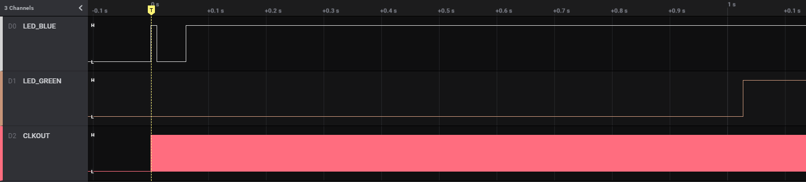
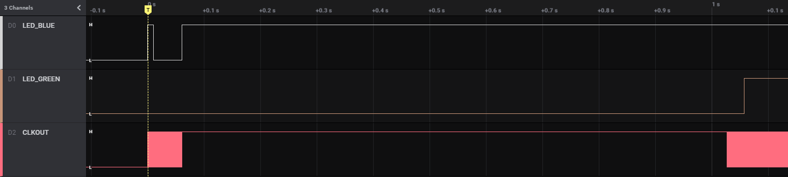
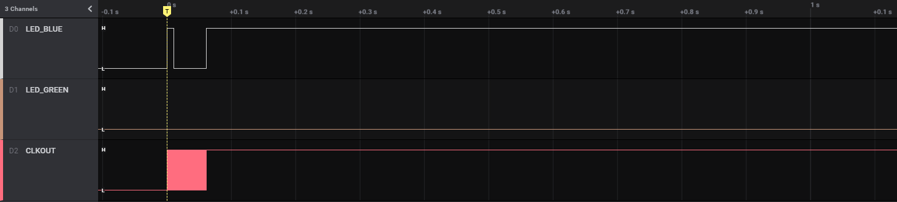

# LPM Demo Application
This demo application was intended to test and measure the differences of the sleep and software standby modes using an EK-RA6M4. Using the AGT1 and AGT3 as wake up sources, it seems that the AGT3 underflow interrupt does not wake up the MCU even though it is listed as a valid source in the RA6M4 Group User Manual and the properties of the `r_lpm` driver.

## Overview
This is the basic flow of the program:
- XTAL (24 MHz) is used as the main clock source and is also connected to CLKOUT/64 (P205)
- The blue LED is turned on for 10ms which can be used for triggering the logic analyzer/oscilloscope. 
- The timer as well as the LPM module are setup according to the configuration down below.
- The timer is started and the blue LED is turned on again to signal the start of the low power mode.
- The specified low power mode is entered.
- After leaving the low power mode, the green LED is turned on.

## Configuration
Right at the top of `src/hal_entry.c`, you can choose the following symbols to be either defined or undefined:  
- `LPM_SLEEP`
  - defined: sleep
  - undefined: software standby

- `LPM_TIMER_AGT1`
  - defined: AGT1
  - undefined: AGT3

The AGT1 and the AGT3 underflow have been selected as wake sources in the LPM driver (only needed for the software standby). Both timers are setup as oneshot timers clocked by LOCO with a period of 1 second.

## Observed Behavior
Using "sleep" as the low power mode, CLKOUT continues to output and the MCU gets woken up by both timers as expected.  
Using "software standby" as the low power mode, the CLKOUT stops (as expected) but only AGT1 can wake up the MCU. It is unclear why AGT3 fails to do so.

Sleep & AGT1

Sleep & AGT3

Software Standby & AGT1

Software Standby & AGT3

